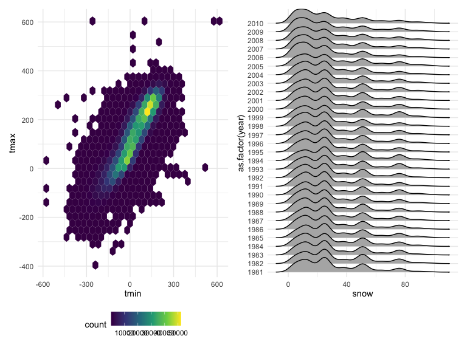
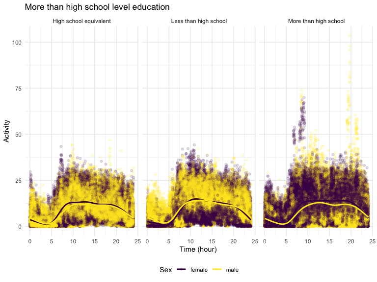
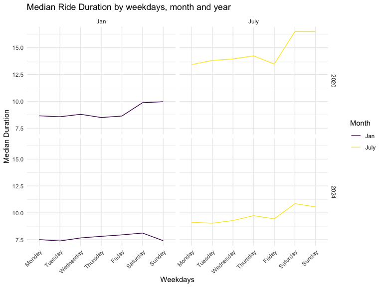

Homework 3
================

# Problem 1

## importing data and cleaning up

``` r
data("ny_noaa")

ny_noaa %>% 
  count(snow) %>%
  arrange(desc(n))
```

    ## # A tibble: 282 × 2
    ##     snow       n
    ##    <int>   <int>
    ##  1     0 2008508
    ##  2    NA  381221
    ##  3    25   31022
    ##  4    13   23095
    ##  5    51   18274
    ##  6    76   10173
    ##  7     8    9962
    ##  8     5    9748
    ##  9    38    9197
    ## 10     3    8790
    ## # ℹ 272 more rows

``` r
ny_noaa = 
  ny_noaa %>% 
  separate(date, into = c("year", "month", "day"), convert = TRUE) %>% 
  mutate(
    tmax = as.numeric(tmax),
    tmin = as.numeric(tmin))
```

``` r
ny_noaa %>% 
  group_by(id, year, month) %>% 
  filter(month %in% c(1, 7)) %>% 
  summarize(mean_tmax = mean(tmax, na.rm = TRUE, color = id)) %>% 
  ggplot(aes(x = year, y = mean_tmax, group = id)) + geom_point() + geom_path() +
  facet_grid(~month) +
  labs(title = "Mean monthly temperature for each station across years for January and July")
```

    ## `summarise()` has grouped output by 'id', 'year'. You can override using the
    ## `.groups` argument.


``` r
hex = 
  ny_noaa %>% 
  ggplot(aes(x = tmin, y = tmax)) + 
  geom_hex()

ridge = 
  ny_noaa %>% 
  filter(snow < 100, snow > 0) %>%
  ggplot(aes(x = snow, y = as.factor(year))) + 
  geom_density_ridges()

hex + ridge
```

    ## Picking joint bandwidth of 3.76



# Problem 2

## importing data and cleaning up

``` r
participant = read_csv("data/participant.csv", skip = 4) %>% 
  janitor::clean_names() %>% 
  mutate(
    sex = case_match(
      sex,
      1 ~ "male",
      2 ~ "female"),
    education = case_match(
      education,
      1 ~ "Less than high school",
      2 ~ "High school equivalent",
      3 ~ "More than high school"
    ),
    education = as.factor(education)
  )
```

    ## Rows: 250 Columns: 5
    ## ── Column specification ────────────────────────────────────────────────────────
    ## Delimiter: ","
    ## dbl (5): SEQN, sex, age, BMI, education
    ## 
    ## ℹ Use `spec()` to retrieve the full column specification for this data.
    ## ℹ Specify the column types or set `show_col_types = FALSE` to quiet this message.

``` r
accelerometer = read_csv("data/accelerometer.csv",) %>% 
  janitor::clean_names() %>% 
  pivot_longer(
    cols = min1:min1440,
    names_to = "time_elasped",
    names_transform = list(time_elasped = as.integer),
    values_to = "mims",
    names_prefix = "min"
  )
```

    ## Rows: 250 Columns: 1441
    ## ── Column specification ────────────────────────────────────────────────────────
    ## Delimiter: ","
    ## dbl (1441): SEQN, min1, min2, min3, min4, min5, min6, min7, min8, min9, min1...
    ## 
    ## ℹ Use `spec()` to retrieve the full column specification for this data.
    ## ℹ Specify the column types or set `show_col_types = FALSE` to quiet this message.

``` r
study = left_join(participant, accelerometer, by = "seqn") %>% 
  filter(age >= 21) %>% 
  drop_na(education)
```

``` r
participant %>%
  drop_na(education) %>% 
  count(sex, education)
```

    ## # A tibble: 6 × 3
    ##   sex    education                  n
    ##   <chr>  <fct>                  <int>
    ## 1 female High school equivalent    23
    ## 2 female Less than high school     29
    ## 3 female More than high school     59
    ## 4 male   High school equivalent    37
    ## 5 male   Less than high school     28
    ## 6 male   More than high school     56

``` r
#Female Age Distribution
participant %>% drop_na(education) %>% 
  ggplot(aes(x= age, fill = education)) +
  facet_grid(.~sex) +
  geom_histogram(bins = 6, position = "dodge")+ 
  labs(title = "Age distributions for male and female in each education category")
```


Based on the plot above, females in the 40 to have the greatest number
of people that had more than high school level education. Generally,
males demonstrate to have had greatest number of more than high school
level education up until 60. After 60 age group, the general education
level tends to decrease with greater number of both female and male
population who had less than high school level education. Overall, the
younger generation definitely seemed to be more invested in the level of
education with trend of higher education decreasing as the age
increases.

``` r
total_activity = aggregate(
  study['mims'], by = study[c('seqn', 'sex', 'age', 'bmi', 'education')], FUN = 'sum'
  ) %>% 
  rename(total_activity = mims)

total_activity %>% 
ggplot(aes(x = age, y = total_activity, color = education))+
  facet_grid(.~sex) +
  geom_smooth(se = FALSE)+
  geom_point()+ 
  labs(title = "Total Activities vs Age",
       x = "Age",
       y = "Total Activities",
       color = "Education") +
  viridis::scale_color_viridis(discrete = TRUE) + 
  theme_minimal() + 
  theme(legend.position = "bottom")
```

    ## `geom_smooth()` using method = 'loess' and formula = 'y ~ x'


Based on the plot above, I can observe that there is an overall
decreasing total for all education level as age increases. Though one
thing to note is that group with less than high school level education
has the greatest total activities to begin with for both sex around age
20.

``` r
more_than_hs = 
  study %>% 
  filter(education == "More than high school")  %>% 
  ggplot(aes(x = time_elasped/60, y= mims, color = sex)) +
  geom_point(alpha = 0.5) +
  geom_smooth(se = FALSE) +
  labs(title = 'More than high school level education',
       x = 'Time_elasped(hour)', 
       y = 'Activity') +
  theme(legend.position = "none")

hs_equiv = 
  study %>% 
  filter(education == "High school equivalent") %>% 
  ggplot(aes(x = time_elasped/60, y= mims, color = sex))  +
  geom_point(alpha = 0.5) +
  geom_smooth(se = FALSE) +
  labs(title = 'High school level education',
       x = 'time_elasped(hour)', 
       y = 'Activity') +
  theme(legend.position = "none")

less_than_hs = 
  study %>% 
  filter(education == "Less than high school")  %>% 
  ggplot(aes(x = time_elasped/60, y= mims, color = sex))  +
  geom_point(alpha = 0.5) +
  geom_smooth(se = FALSE) +
  labs(title = 'Less than high school level education',
       x = 'time_elasped(hour)',
       y = 'Activity') + 
  theme(legend.position = "bottom")

(more_than_hs / hs_equiv) / less_than_hs
```

    ## `geom_smooth()` using method = 'gam' and formula = 'y ~ s(x, bs = "cs")'
    ## `geom_smooth()` using method = 'gam' and formula = 'y ~ s(x, bs = "cs")'
    ## `geom_smooth()` using method = 'gam' and formula = 'y ~ s(x, bs = "cs")'



## Problem 3

``` r
Jan2020 = read_csv("data/citibike/Jan 2020 Citi.csv.zip") %>% 
  janitor::clean_names() %>% 
  mutate(
    date = "Jan 2020"
  )

Jan2024 = read_csv("data/citibike/Jan 2024 Citi.csv.zip") %>% 
  janitor::clean_names() %>% 
  mutate(
    date = "Jan 2024"
  )

July2020 = read_csv("data/citibike/July 2020 Citi.csv.zip") %>% 
  janitor::clean_names() %>% 
  mutate(
    date = "July 2020"
  )

July2024 = read_csv("data/citibike/July 2024 Citi.csv.zip") %>% 
  janitor::clean_names() %>% 
  mutate(
    date = "July 2024"
  )
```

``` r
citi = bind_rows(
  Jan2020, Jan2024, July2020, July2024
)
```

``` r
citi %>% 
  count(date, member_casual)
```

    ## # A tibble: 8 × 3
    ##   date      member_casual     n
    ##   <chr>     <chr>         <int>
    ## 1 Jan 2020  casual          984
    ## 2 Jan 2020  member        11436
    ## 3 Jan 2024  casual         2108
    ## 4 Jan 2024  member        16753
    ## 5 July 2020 casual         5637
    ## 6 July 2020 member        15411
    ## 7 July 2024 casual        10894
    ## 8 July 2024 member        36262

Based on the table above, we can see that Citi Bike members are take the
ride more frequently overall. However, there has been a drastic increase
in both casual and member riders in July 2024 compared to other dates.

### 5 most popular starting stations for July 2024

``` r
citi %>% 
  filter(date == "July 2024") %>% 
  count(start_station_name) %>% 
  arrange(desc(n)) %>% 
  head(5)
```

    ## # A tibble: 5 × 2
    ##   start_station_name           n
    ##   <chr>                    <int>
    ## 1 Pier 61 at Chelsea Piers   163
    ## 2 University Pl & E 14 St    155
    ## 3 W 21 St & 6 Ave            152
    ## 4 West St & Chambers St      150
    ## 5 W 31 St & 7 Ave            146

``` r
citi = citi %>% 
  separate(date, c('month', 'year'), sep = " ", remove = TRUE)
```

``` r
weekdays = 
  aggregate(x= citi['duration'], by = citi[c('weekdays')] , FUN = median)

month = 
  aggregate(x = citi['duration'], by = citi[c('month')], FUN = median)

year =
    aggregate(x = citi['duration'], by = citi[c('year')], FUN = median)
```

``` r
ggplot(data = weekdays, aes(x = weekdays, y = duration), color = year) +
  geom_point() +
  geom_smooth()
```

    ## `geom_smooth()` using method = 'loess' and formula = 'y ~ x'


